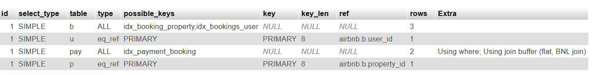

# Optimization Report after
Query on the [performance.sql](docs/data-flow.md) is used to retrieves all bookings along with the user details, property details, and payment details.  
Then tried to analyze the query's performace by using "EXPLAIN" key word:

